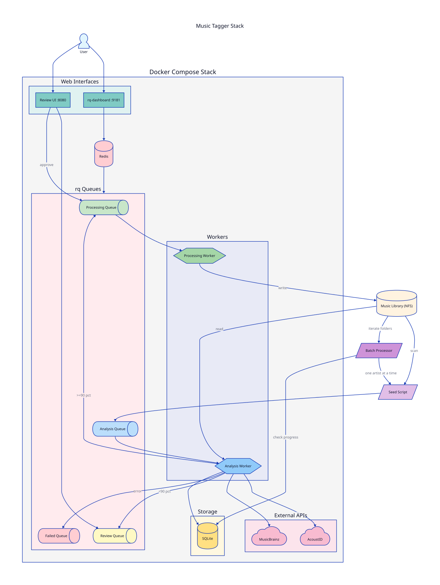

# Music Tagger

A self-hosted Docker application for auditing and correcting music library metadata using acoustic fingerprinting and MusicBrainz.

## Features

- **Acoustic Fingerprinting**: Uses Chromaprint/fpcalc to identify tracks by their audio content, not just existing metadata
- **MusicBrainz Integration**: Matches fingerprints against the comprehensive MusicBrainz database via AcoustID
- **Confidence-Based Routing**: High-confidence matches are auto-approved; lower confidence matches go to a review queue
- **Web UI**: Review and approve/reject metadata changes with a side-by-side diff view
- **Bulk Operations**: Approve or reject multiple tracks at once
- **Queue-Based Architecture**: Redis + rq for reliable job processing with pause/resume support
- **Rate Limiting**: Built-in delays to respect API limits and network bandwidth
- **Non-Destructive by Default**: Tag writing is a separate phase that must be explicitly enabled

## Architecture



## Prerequisites

- Docker and Docker Compose
- An AcoustID API key (free): https://acoustid.org/new-application

## Quick Start

1. **Clone the repository**
   ```bash
   git clone https://github.com/Nonagon-Media/music-tagger.git
   cd music-tagger
   ```

2. **Configure environment**
   ```bash
   cp .env.example .env
   # Edit .env with your settings:
   # - MUSIC_DIR: path to your music library
   # - ACOUSTID_API_KEY: your API key from acoustid.org
   ```

3. **Start the stack (analysis phase)**
   ```bash
   docker compose up -d redis analysis-worker rq-dashboard review-ui
   ```

4. **Seed the analysis queue**
   ```bash
   # Queue all music files
   docker compose run --rm analysis-worker python seed.py

   # Or queue a specific artist
   docker compose run --rm analysis-worker python seed.py --artist "Pink Floyd"

   # Dry run to see what would be queued
   docker compose run --rm analysis-worker python seed.py --dry-run
   ```

5. **Monitor progress**
   - rq-dashboard: http://localhost:9181
   - Review UI: http://localhost:8080

   > **Note:** The Review UI contains a link to rq-dashboard that uses `localhost`. If you're accessing the Review UI remotely (via reverse proxy, SSH tunnel, etc.), this link won't work. Navigate to your-host:9181 directly instead.

6. **Review matches**

   Visit http://localhost:8080 to review low-confidence matches. The UI shows:
   - Current metadata vs. MusicBrainz match
   - Confidence score
   - Approve/Reject buttons
   - Bulk selection for batch operations

7. **Enable tag writing (when ready)**
   ```bash
   docker compose --profile apply up -d processing-worker
   ```

8. **Batch processing (for large libraries)**
   ```bash
   # Start batch processor - processes one artist at a time with pauses
   docker compose --profile batch --profile apply up -d batch-processor processing-worker

   # Monitor progress
   tail -f logs/batch_process.log
   ```

   The batch processor:
   - Processes one artist folder at a time
   - Waits 5 minutes between artists (configurable)
   - Skips already-processed artists
   - Logs progress to `logs/batch_process.log`

## Configuration

| Variable | Default | Description |
|----------|---------|-------------|
| `MUSIC_DIR` | (required) | Path to your music library |
| `ACOUSTID_API_KEY` | (required) | Your AcoustID API key |
| `CONFIDENCE_THRESHOLD` | `80` | Auto-approve threshold (0-100) |
| `RATE_LIMIT_DELAY` | `0.5` | Seconds between API calls |
| `WRITE_DELAY` | `0.5` | Seconds between tag writes |
| `DASHBOARD_PORT` | `9181` | Port for rq-dashboard |
| `UI_PORT` | `8080` | Port for review UI |
| `PUID` | `1000` | User ID for worker containers |
| `PGID` | `1000` | Group ID for worker containers |

## Supported Formats

- MP3 (ID3v2)
- FLAC
- M4A/MP4 (AAC)
- OGG (planned)
- WMA (planned)

## Processing Time Estimates

Processing time depends on library size and network speed:

| Library Size | Fingerprinting | API Lookups | Total |
|--------------|----------------|-------------|-------|
| 1,000 tracks | ~30 min | ~15 min | ~1 hour |
| 10,000 tracks | ~5 hours | ~2.5 hours | ~8 hours |
| 50,000 tracks | ~25 hours | ~12 hours | ~2 days |
| 100,000 tracks | ~50 hours | ~25 hours | ~4 days |

The processing worker writes tags slowly by design to avoid overwhelming network storage.

## Stopping and Resuming

The queue-based architecture supports pause/resume:

```bash
# Stop workers (queue state is preserved)
docker compose stop analysis-worker processing-worker

# Resume later
docker compose start analysis-worker processing-worker
```

Progress is saved in the SQLite database (`data/music_tagger.db`).

## Data Storage

All persistent data is stored in the `./data` directory:

- `music_tagger.db`: SQLite database with job state and metadata
- Fingerprint cache (future enhancement)

## Troubleshooting

### No matches found
- Ensure the track is in MusicBrainz (not all music is catalogued)
- Check if the audio file is corrupted or too short
- Live recordings and rare releases may not have fingerprints

### API rate limiting
- Increase `RATE_LIMIT_DELAY` in your `.env`
- The default 0.5s should be safe for personal use

### Permission denied writing tags
- Check that `MUSIC_DIR` is mounted with write access
- The processing-worker needs `:rw` mount (default in compose file)
- For NFS mounts or non-root file ownership, set `PUID` and `PGID` in `.env` to match your file owner:
  ```bash
  # Find your user's UID/GID
  id -u  # PUID
  id -g  # PGID
  ```
- The `data/` directory must also be writable by the container user (for SQLite)

### Worker crashes
- Check `docker compose logs analysis-worker`
- Failed jobs appear in the "failed" queue and can be retried

## Contributing

Contributions are welcome! Please feel free to submit issues or pull requests.

## License

MIT License - see [LICENSE](LICENSE) for details.

## Acknowledgments

- [AcoustID](https://acoustid.org/) - Audio fingerprint database
- [MusicBrainz](https://musicbrainz.org/) - Open music encyclopedia
- [Chromaprint](https://acoustid.org/chromaprint) - Audio fingerprinting library
- [rq](https://python-rq.org/) - Simple Python job queues
